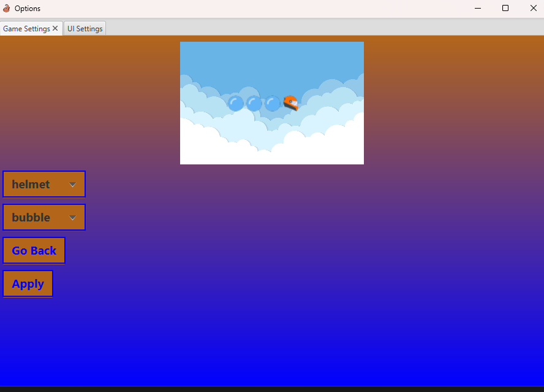
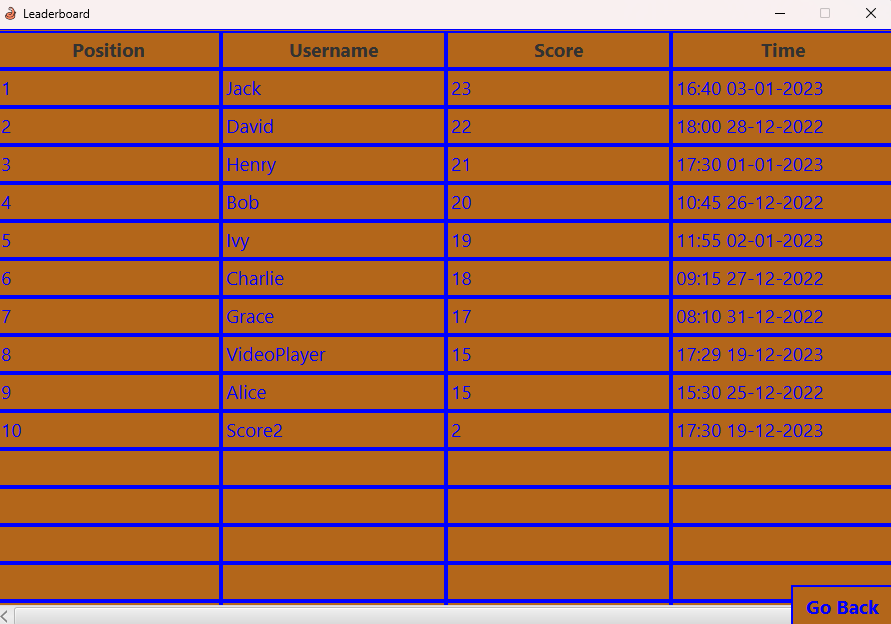
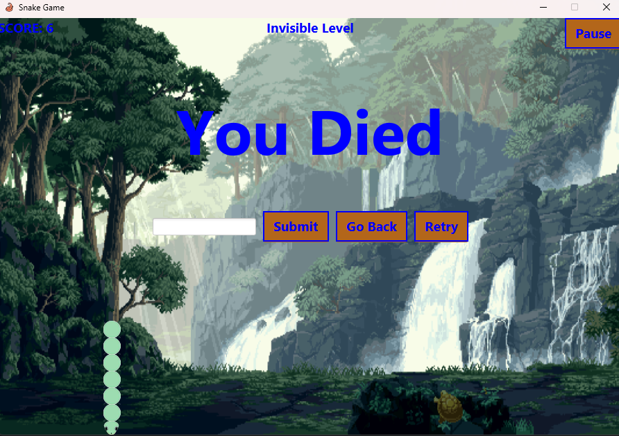

# README.md

# COMP2013 - Snake Game

### Snakee Yipiee
### Author: Abdullah Tukur

**Brief Project Description:**
- Snakee Yipee is a multi-level snake game developed using JavaFX. The player controls the snake with arrow keys eating fruit 
- The Goal is to get the highest score and get on the leaderboard . 
- Features include a Customisable Snake Skins,

-  Leaderbord: 

**How to Install and Run Snakee Yipiee:**
1. **Prerequisites**: Ensure The lastest version of Java and JavaFX SDK are installed on your computer. (At Least Java 17 or JavaFX 17)

2. **Download**: Access and Download the ZIP given. 

3. **Complile and Bulid the Project**: Open a terminal and go to the directory where the game is held and run ``mvn clean install``

This will install all the dependancies needed 

then to run the game.

Then to run the application ``mvc exec:java`` should launch it
**How to Play the Game:**
- **Starting the Game**: begin Game by pressing Play. A countdown will start and after you can move the snake. You will begin the Default Level 
- **Gameplay Instructions**: Use the arrow keys to control the snakes movement around the screen.
- **Game Objective**: Eat the fruit without hitting the wall , eating yourself and avoid the poop
- **Scoring System**: Static Food - 1 Point , AIMoveFood - 5 Points , NegativeFood - -1 Point

